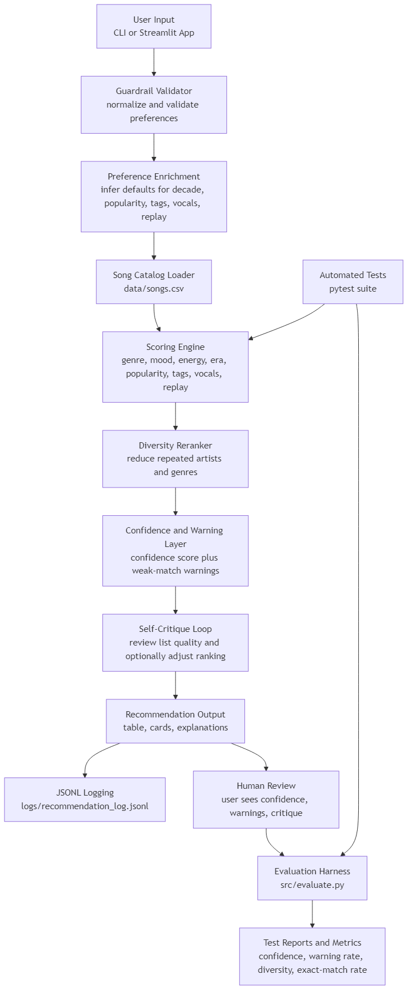

# MusixxMatch: An Explainable, Reliable, and Self-Critiquing Music Recommendation System

## Original Project
This project extends my earlier **Music Recommender Simulation** from Modules 1-3. The original version was a CLI-based content recommender that matched songs to a listener profile using genre, mood, energy, and acoustic preference. Its goal was to show how a transparent scoring system could produce personalized recommendations from a structured music catalog.

For this final project, I redesigned that prototype into a more complete applied AI system with guardrails, confidence scoring, logging, automated evaluation, an agentic self-critique loop, and a Streamlit interface. The final system still values explainability, but now it also makes reliability and uncertainty visible.

## Project Summary
**MusixxMatch** is an explainable music recommendation system that helps listeners discover songs aligned with their preferences while exposing how the recommendation was made. Instead of acting like a black box, MusixxMatch scores songs using interpretable features, estimates confidence, warns when matches are weak, logs recommendation sessions, and runs a self-critique pass over its own output.

This project matters because recommendation systems shape attention and taste. MusixxMatch demonstrates a more responsible approach by combining personalization with transparency, reliability checks, and explicit limitations.

## Core AI Features
This project satisfies the final-project requirement through two integrated AI feature areas:

- **Reliability or Testing System:** MusixxMatch validates inputs, assigns confidence scores, adds low-confidence warnings, logs recommendation runs, and includes an evaluation harness plus automated tests.
- **Agentic Workflow:** After generating recommendations, the system runs a self-critique loop that reviews the list, flags weak or repetitive results, and can promote a stronger second choice over a weaker top pick.

## Stretch Features
- **Agentic Workflow Enhancement (+2):** I implemented a multi-step reasoning loop that generates recommendations, critiques the resulting list, adds critique notes, and can adjust the final ranking.
- **Test Harness / Evaluation Script (+2):** I built an evaluation script that runs the system on predefined listener profiles and reports confidence, warning rate, diversity, exact-match rate, and strongest versus weakest profile performance.

## Architecture Overview
MusixxMatch is organized as a modular pipeline:

1. The user enters preferences through the CLI or Streamlit app.
2. A guardrail layer validates and normalizes the input.
3. The scoring engine compares each song to the user profile across genre, mood, energy, popularity, era, mood tags, vocal presence, and replay value.
4. A diversity reranker reduces repetition from the same artist or genre.
5. A confidence layer estimates recommendation strength and adds warnings for weak matches.
6. A self-critique loop reviews the overall list and attaches higher-level critique notes, and in some cases adjusts the ordering.
7. The final recommendations are shown to the user and saved to a JSONL log.
8. A separate evaluation harness tests the system across predefined profiles and summarizes reliability metrics.

The Mermaid source for the architecture diagram is included in [assets/musixxmatch-architecture.mmd](/c:/Users/saifs/ai110-applied-ai-system-final-project/assets/musixxmatch-architecture.mmd:1). You can paste it into Mermaid Live Editor and export a PNG into the `assets/` folder.



## Repository Structure
- [src/recommender.py](/c:/Users/saifs/ai110-applied-ai-system-final-project/src/recommender.py:1): core scoring, confidence, warnings, and self-critique logic
- [src/main.py](/c:/Users/saifs/ai110-applied-ai-system-final-project/src/main.py:1): CLI entry point
- [src/streamlit_app.py](/c:/Users/saifs/ai110-applied-ai-system-final-project/src/streamlit_app.py:1): Streamlit app for MusixxMatch
- [src/evaluate.py](/c:/Users/saifs/ai110-applied-ai-system-final-project/src/evaluate.py:1): evaluation harness
- [src/logging_utils.py](/c:/Users/saifs/ai110-applied-ai-system-final-project/src/logging_utils.py:1): JSONL logging helpers
- [src/profiles.py](/c:/Users/saifs/ai110-applied-ai-system-final-project/src/profiles.py:1): shared listener profiles for demos and evaluation
- [tests](/c:/Users/saifs/ai110-applied-ai-system-final-project/tests): automated test suite
- [data/songs.csv](/c:/Users/saifs/ai110-applied-ai-system-final-project/data/songs.csv:1): song catalog

## Setup Instructions
1. Clone the repository:

```bash
git clone <your-repo-url>
cd applied-ai-system-final-project
```

2. Create and activate a virtual environment if desired:

```bash
python -m venv .venv
.venv\Scripts\activate
```

3. Install dependencies:

```bash
pip install -r requirements.txt
```

4. Run the CLI version:

```bash
python -m src.main
```

5. Run the evaluation harness:

```bash
python -m src.evaluate
```

6. Run the Streamlit app:

```bash
streamlit run src/streamlit_app.py
```

7. Run the automated tests:

```bash
python -m pytest -q
```

## Sample Interactions

### Example 1: High-Energy Pop Listener
**Input**
- favorite genre: `pop`
- favorite mood: `happy`
- target energy: `0.8`
- likes acoustic: `False`
- scoring mode: `genre_first`

**Output**
- top recommendation: `Sunrise City - Neon Echo`
- confidence: `0.85`
- warnings: `None`
- explanation included genre match, mood match, energy similarity, popularity fit, preferred era match, mood-tag overlap, and replay-value fit

### Example 2: Conflicting High-Energy Moody Listener
**Input**
- favorite genre: `pop`
- favorite mood: `moody`
- target energy: `0.9`
- likes acoustic: `False`
- scoring mode: `mood_first`

**Output**
- top recommendation: `Night Drive Loop - Neon Echo`
- average confidence across the list was low
- weaker recommendations were flagged with low-confidence warnings
- the self-critique loop added a note that the list should be treated as exploratory suggestions

### Example 3: Perfect Match with Acoustic Listener
**Input**
- favorite genre: `lofi`
- favorite mood: `chill`
- target energy: `0.4`
- likes acoustic: `True`
- scoring mode: `genre_first`

**Output**
- top recommendation: `Midnight Coding - LoRoom`
- confidence: `0.88`
- warnings: `None`
- self-critique noted that the broader list leaned heavily on one artist, surfacing a discovery-diversity trade-off

## Design Decisions and Trade-Offs
I chose an explainable rules-based recommender instead of a black-box model because the project goal was not only to generate recommendations, but to make the system’s reasoning visible and testable. This made it possible to attach confidence scores, warnings, critique notes, and evaluation metrics directly to the recommendation pipeline.

I also separated the project into focused modules for scoring, logging, evaluation, shared demo profiles, and the Streamlit app. That modular structure made it easier to add new features incrementally and test each one in isolation.

The main trade-off is interpretability versus flexibility. Exact labels and hand-designed weights make the output easier to understand, but they also limit nuance. A production recommender would likely use softer similarity matching, larger catalogs, user behavior signals, and richer embeddings.

## Testing Summary
MusixxMatch includes automated tests, confidence scoring, warnings, logging, and a dedicated evaluation harness.

Current status:
- automated test suite: `20 passed`
- root-level `pytest` execution is reproducible
- JSONL recommendation logs are written successfully
- CLI, evaluation harness, and Streamlit app all run successfully

Evaluation summary from [src/evaluate.py](/c:/Users/saifs/ai110-applied-ai-system-final-project/src/evaluate.py:1):
- profiles evaluated: `8`
- average confidence: `0.58`
- average low-confidence rate: `0.28`
- average warning rate: `0.75`
- average genre diversity: `0.88`
- average exact-match rate: `0.53`
- strongest profile: `Perfect Match with Acoustic`
- weakest profile: `Conflicting High-Energy Moody`

What worked well:
- clear listener profiles produced believable recommendations
- confidence scores and warnings made weak scenarios easier to spot
- the self-critique loop surfaced list-level issues that a single recommendation score would miss

What did not work as well:
- conflicting or sparse preferences still produce weaker matches
- exact genre and mood matching can be overly rigid
- some recommendation lists are structurally reasonable but still musically imperfect because the catalog is small

## Reflection
This project taught me that a useful AI system is not just about producing outputs, but about making those outputs trustworthy. A recommendation can look smart on the surface, but without guardrails, confidence estimates, warnings, logging, and evaluation, it is much harder to know when the system is actually behaving well.

It also showed me how much professional polish can come from responsible engineering practices. The final system is still based on simple and interpretable logic, but adding reliability features and a user interface transformed it from a classroom prototype into a much more portfolio-ready applied AI project.

## Reflection and Ethics

### What are the limitations or biases in the system?
MusixxMatch depends on a small structured catalog, so the quality of its recommendations is constrained by the songs present in [data/songs.csv](/c:/Users/saifs/ai110-applied-ai-system-final-project/data/songs.csv:1). It also relies heavily on exact genre and mood labels, which can oversimplify music taste and miss songs that feel similar but use different metadata. Because the scoring system is hand-designed, it reflects my assumptions about which song attributes should matter most, which introduces design bias.

### Could this AI be misused, and how would I prevent that?
The system could be misused if someone treated its recommendations as objectively correct rather than as suggestions shaped by a small catalog and handcrafted scoring rules. It could also mislead users if confidence scores and warnings were hidden. To reduce misuse, I included transparent explanations, confidence scoring, low-confidence warnings, critique notes, JSONL logging, and clearly documented limitations.

### What surprised me while testing reliability?
What surprised me most was how reasonable some weak matches looked before confidence scoring and warnings were added. Without those layers, a recommendation could feel convincing even when it relied mostly on secondary signals rather than direct genre or mood matches. The evaluation harness made this especially visible for conflicting profiles like `Conflicting High-Energy Moody`.

### How did I collaborate with AI during this project?
AI was useful as a collaborator for brainstorming features, improving project structure, and identifying ways to align the system with the final-project rubric. One especially helpful suggestion was to reframe the recommender as an explainable and reliable applied AI system by adding confidence scoring, guardrails, logging, and an evaluation harness.

One flawed suggestion came up during implementation when a proposed code patch for the confidence layer did not match the current file structure and failed to apply cleanly. That was a helpful reminder that AI can accelerate development, but it still requires human review, correction, and verification. I treated AI as a strong assistant rather than as a source of unquestioned correctness.

## How to Cite the Main Features
If you want the quickest summary of what makes this a final applied AI system, the most important implementation points are:
- `validate_user_preferences(...)` and `validate_recommendation_request(...)` for guardrails
- `calculate_recommendation_confidence(...)` for reliability scoring
- `build_recommendation_warnings(...)` for weak-match detection
- `run_self_critique_loop(...)` for the agentic review step
- `append_jsonl_log(...)` for observability
- `evaluate_profile(...)` and `summarize_evaluation(...)` for evaluation
- [src/streamlit_app.py](/c:/Users/saifs/ai110-applied-ai-system-final-project/src/streamlit_app.py:1) for the MusixxMatch interface

## Model Card
The earlier model card is still available at [model_card.md](/c:/Users/saifs/ai110-applied-ai-system-final-project/model_card.md:1).
