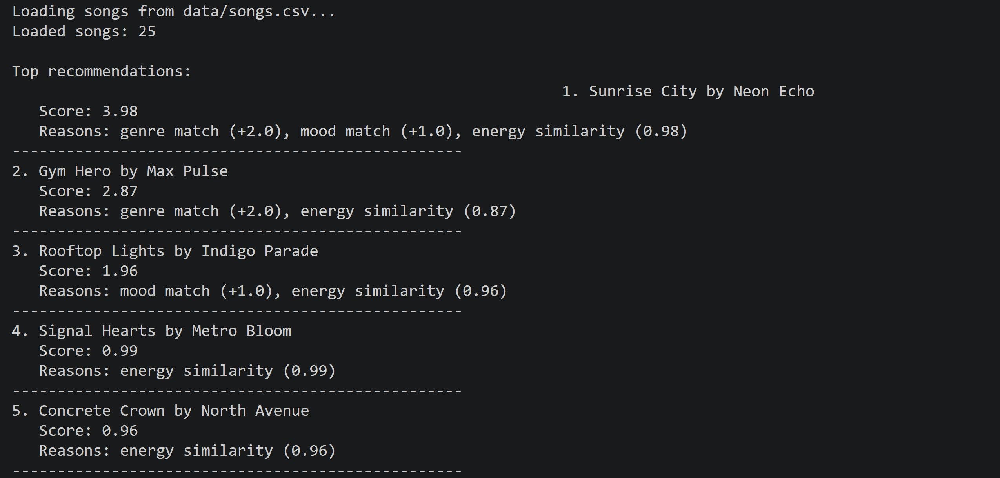

# Music Recommender Simulation

## Project Summary

This project is a CLI-first music recommender simulation that suggests songs from a small catalog using a content-based scoring system. I expanded the dataset, created multiple user taste profiles, and ranked songs by how well they matched each profile's genre, mood, energy, and acoustic preference. The goal of this version is to keep the logic simple and explainable while still showing how recommendation systems can reflect user preferences, produce different outputs for different listeners, and reveal biases in the scoring design.

---

## How The System Works

Real-world recommenders usually combine many signals, such as what similar users liked, what features a song has, and what someone seems to want in the current moment. My simulation focuses on the content-based part of that idea: it compares the attributes of each song to a user's taste profile and gives higher scores to songs that are closer to the user's preferred vibe. In this version, I prioritize transparent and explainable recommendations over complexity, so the system rewards strong matches in genre, mood, and a few numeric audio features rather than trying to learn from large-scale user behavior.

This music recommender uses a point-based scoring algorithm to match songs to user preferences. The system loads songs from a CSV file, scores each song individually against the user's profile, ranks them by score, and returns the top recommendations.

### Algorithm Recipe

1. Genre match adds points when the song's genre matches the user's favorite genre.
2. Mood match adds points when the song's mood matches the user's favorite mood.
3. Energy similarity adds more points when the song's energy is close to the user's target energy.
4. Acoustic preference adds a small bonus when the user likes acoustic songs and the song has high acousticness.

`Song` features used in this simulation:

- `title`
- `artist`
- `genre`
- `mood`
- `energy`
- `tempo_bpm`
- `valence`
- `danceability`
- `acousticness`

`UserProfile` features used in this simulation:

- preferred `genre`
- preferred `mood`
- preferred `energy`
- `likes_acoustic`

### Example Output

The screenshot below shows the recommender loading the dataset and printing the top song recommendations with their scores and explanation strings.



### User Profile Recommendation Screenshots

The following screenshots show recommendation outputs for multiple user profiles tested in the CLI-first simulation.

#### User Profile 1


#### User Profile 2


#### User Profile 3


#### User Profile 4


#### User Profile 5


#### User Profile 6


#### User Profile 7


#### User Profile 8


---

## Getting Started

### Setup

1. Create a virtual environment if you want:

```bash
python -m venv .venv
source .venv/bin/activate
```

On Windows:

```bash
.venv\Scripts\activate
```

2. Install dependencies:

```bash
pip install -r requirements.txt
```

3. Run the app:

```bash
python -m src.main
```

### Running Tests

Run the starter tests with:

```bash
pytest
```

---

## Experiments You Tried

I tested the recommender with eight different user profiles so I could see whether the output changed in believable ways. Profiles like `Chill Lofi` and `Deep Intense Rock` gave clearly different top songs, which made the system feel valid because it was responding to real preference changes instead of always repeating the same result.

One important experiment was changing the weights so energy mattered more and genre mattered less. That made some rankings feel more natural. For example, `Rooftop Lights` moved above `Gym Hero` for a happy pop listener because it fit the mood and energy better, even without the exact same genre label.

I also compared low-energy and high-energy boundary profiles to test the sensitivity of the energy rule. Those experiments showed that the system responds strongly to energy, which is useful, but they also revealed that energy can dominate too much and cause certain songs to appear again and again.

---

## Limitations and Risks

This recommender has a very small catalog, so it cannot represent the full range of real music taste. It also does not use lyrics, language, listening history, or artist popularity, which means it misses many important reasons why people like songs.

Another limitation is that genre and mood only work on exact text matches. If two songs are close in style but use different labels, the system may treat them as unrelated. That can make the output feel narrow for users with mixed or flexible tastes.

The biggest risk in the current scoring system is that energy can become too powerful. Because every song receives an energy score, songs with similar energy can keep appearing near the top even when they are not the best match in genre or mood. This is why a song like `Gym Hero` can show up for users who did not really want intense pop.

---

## Reflection

[**Model Card**](model_card.md)

My biggest learning moment in this project was realizing that even a simple point-based system can feel like a real recommendation engine when the features are chosen carefully. Once I tested several user profiles, I could see how small changes in genre, mood, or energy changed the ranking in ways that often felt intuitive. At the same time, I also saw how easy it is for a scoring rule to create bias, especially when one feature like energy affects every song and pushes certain tracks upward again and again.

AI tools helped me move faster when I was brainstorming profiles, writing explanations, improving documentation, and testing how changes in weights affected the results. I still had to double-check the code, the math, and the written summaries, because a helpful suggestion is not always the same thing as a correct one. What surprised me most was how a simple algorithm could still "feel" smart, even though it was only using a few fields and hand-written rules. If I extended this project, I would add softer matching between related genres, include more song features in the score, and add a diversity rule so the top recommendations do not feel too repetitive.

---

## 1. Model Name

`VibeMatch 1.0`

## 2. Intended Use

This model is designed for classroom exploration and simple experimentation. It recommends songs from a small catalog based on a listener's preferred genre, mood, energy, and acoustic preference. It is useful for showing how a content-based recommender works in plain language. It is not meant for real users or production streaming platforms.

## 3. How It Works (Short Explanation)

The recommender looks at each song and compares it to the user's taste profile. It gives points for genre match, mood match, and energy similarity, and it gives a small extra bonus for acoustic songs when the user likes acoustic music. After scoring all songs, it sorts them from highest score to lowest score and returns the top recommendations. This makes the system easy to explain because each recommendation comes from a small set of visible rules.

## 4. Data

The dataset contains 25 songs in `data/songs.csv`. Each song has a title, artist, genre, mood, energy, tempo, valence, danceability, and acousticness. I expanded the starter file to add more genres and moods so the system could be tested on a wider range of user profiles. Even with those additions, the dataset is still small and does not include real listening behavior.

## 5. Strengths

The system works best for users with clear preferences, such as chill lofi listeners, intense rock listeners, or upbeat pop listeners. In those cases, the results often feel believable because the model captures broad vibe differences well. Another strength is that the scoring logic is transparent, so it is easy to understand why a song ranked high. That makes it useful for learning, debugging, and reflection.

## 6. Limitations and Bias

The system depends on exact labels for genre and mood, so it may miss songs that are similar but described with different words. It also gives energy to every song, which can make energy too important compared with other signals. That can create repetition or filter-bubble behavior, where certain songs keep rising because they sit near common energy targets. This is one reason songs like `Gym Hero` can appear for several different profiles.

## 7. Evaluation

I evaluated the recommender by running it with eight different user profiles and comparing the top results to my musical intuition. I checked whether the outputs changed in sensible ways when the profile changed from calm to intense, acoustic to electronic, or exact-match to no-categorical-match cases. I also ran a weight-shift experiment to see how sensitive the rankings were to scoring choices. That evaluation helped me notice both the strengths of the system and the places where energy bias was too strong.

## 8. Future Work

If I kept developing this project, I would add more user preference fields like tempo, valence, and danceability. I would also use softer matching for related genres and moods instead of requiring exact text matches. Another improvement would be adding a diversity rule so the top recommendations feel less repetitive and cover a wider range of songs.

## 9. Personal Reflection

My biggest learning moment was realizing that even a simple rules-based system can feel surprisingly smart when the features are chosen well. I also learned that small weight choices can create big changes in ranking and can introduce bias without being obvious at first. AI tools helped me move faster when I was brainstorming, writing, and testing ideas, but I still needed to verify the scoring logic, the outputs, and the documentation carefully. If I extended this project further, I would focus on making the recommender both more flexible and more diverse.
